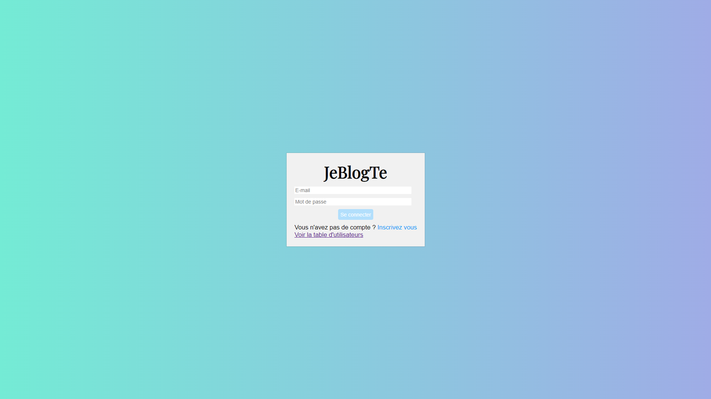
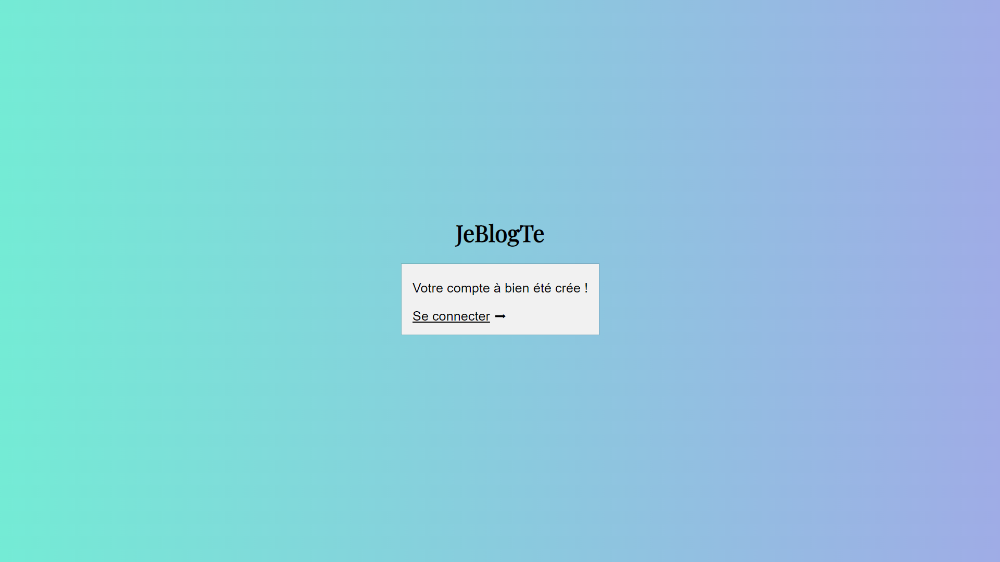
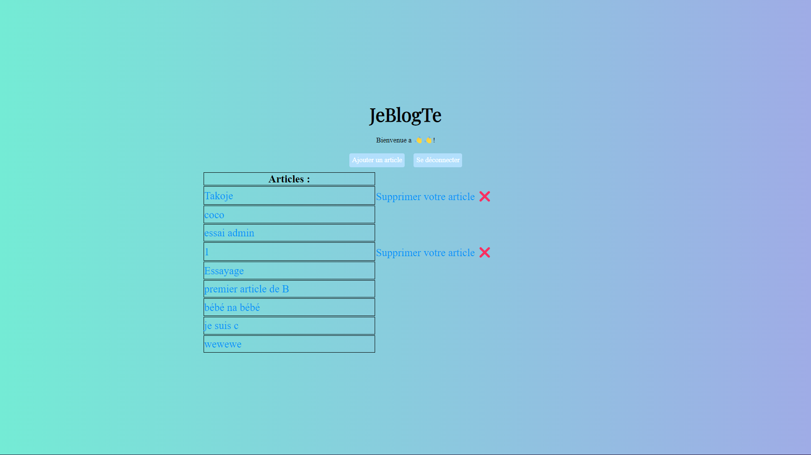
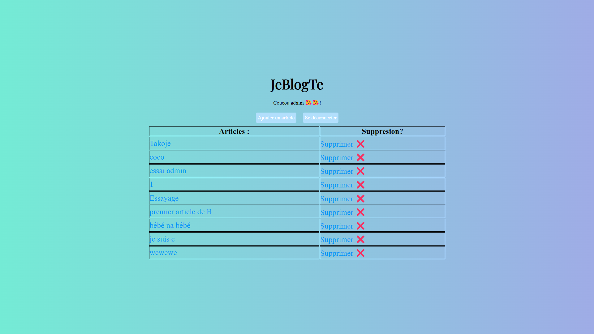
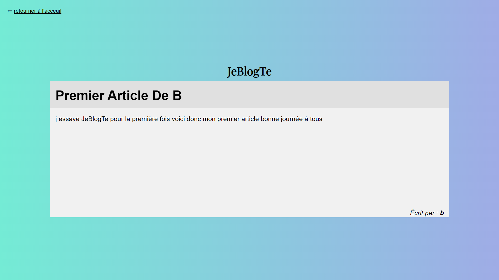
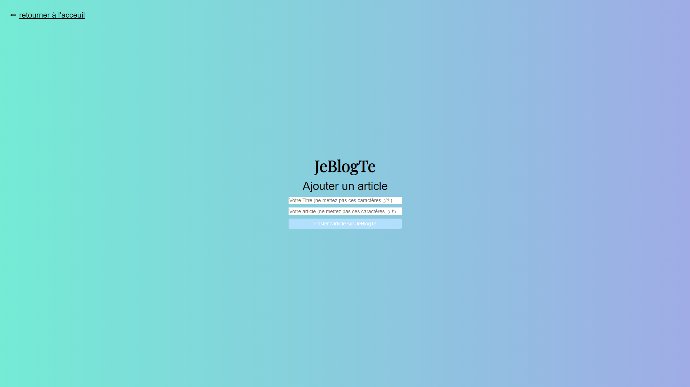

## 
JeBlogTe

Dans le cadre du cours de back-end dans mon [école](https://www.hetic.net/), j'ai eu à réaliser un blog. 
La consigne était que je devais utiliser obligatoirement Docker, Php et Mysql sans aucune autre technologie impliquée. 

## Objectifs du projet

- Renforcer mes compétences en back avec Php et Mysql.
- Apprendre à travailler avec Docker.

## Fonctionnalités

-  Créer un compte.
-  Système de connexion. 
-  Voir tous les articles.
-  Voir un article en particulier.
-  Ajouter un article.
-  En tant qu'utilisateur normal, pouvoir supprimer seulement ses articles.
-  En tant qu'admin, pouvoir supprimer n'importe quel article.
-  Se déconnecter.

## Captures d'écran

  
  

  
  

  
  
  
 

## Technologies utilisées

